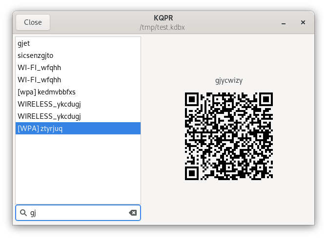

#  KQPR: QR codes for KeePass databases.

KQPR is a Gtk application that loads a [KeePass](https://keepass.info) KDBX file and displays a QR
code for the WiFi passwords found in that database.

## Tagging KeePass Entries

KDBX entries containing the terms `wifi`, `wi-fi`, `wlan`, `wireless` or `wpa` (any casing) in
their titles or usernames will be considered WiFi passwords. By default networks are announced as
WPA2 encrypted. Using the special tags `[wpa3]`, `[wpa2]`, `[wpa]` and `[wep]` (any casing) in the
title of an entry changes this default behavior.

## Desktop integration

Use the `--desktop-install` command-line option to install an icon and desktop entry for the
current user.

## License and Source

KQPR is distributed under the [Apache 2.0](https://spdx.org/licenses/Apache-2.0.html) open source
license. The source is available on [GitHub](https://github.com/senier/kqpr).
